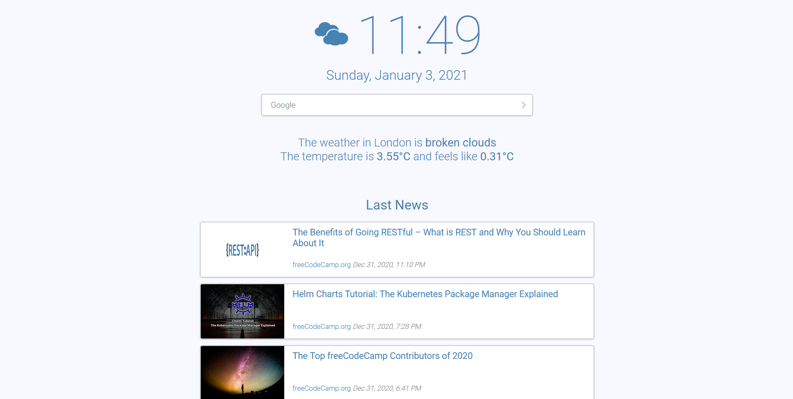

# MyHomepage

This is my browser's homepage. It shows the date and time, the weather and the latest news.

It's fully responsive and customizable.


## Demo

See the demo [here](https://solanspuig.github.io/MyHomepage/).

The weather data and icon in the demo is a placeholder, as there's no API key.


## Setup

Download the project and create a copy of `example_config.js` named `config.js`. Now
set *index.html* as your browser's homepage. 

To see the weather information, you'll need an API key for [OpenWeatherMap](https://openweathermap.org/).
You can get one [here](https://openweathermap.org/price), the free one is enough. Once you get the key, 
copy it and paste it into the field `WEATHER_KEY` in your `config.json`. Refresh the browser. The key can take
a couple of hours to be valid, so don't worry if it doesn't work immediately.


## Screenshots




## Configuration

You can configure the language, the sources of the news feeds, and how the weather information is displayed.
The `example_config.json` should tell you all you need:

```
const LANG = "en"; // The language to display the date, the weather and the text. Look at localization.js to see the options available.

// Weather
const WEATHER_KEY = ""; // Your API key for OpenWeatherMap. Visit https://openweathermap.org/price to get one, the Free one is enough.
                        // You can leave it empty ("") to disable that feature.
const CITY = "London"; // Leave empty ("") to detect from your IP. It won't be as precise.
const TEMP_UNITS = ["metric", "°C"]; // The units of the temperature. Alternatives: ["imperial", "°F"] or ["standard", "K"]
const ICONS = 2 // The icons that represent the weather. Use 0 for none, 1 for Weather Icons or 2 for Open Weather Font.
                // If you don't use Open Weather Font, you can safely delete the "fonts" folder, as well as the "css/owfont.css" file. 

// News
const NEWS_SOURCES = [ // The RSS sources you are interested in. You can leave it empty to disable that feature.
    "https://rss.nytimes.com/services/xml/rss/nyt/Europe.xml"
    // Add more...
];

```

Feel free to add your language to `localization.js`. If you do that, please make a pull request so everybody that speaks your language 
can benefit from your work.

You can input any city you want to get the weather from into `CITY`. Even all the small towns I tried worked fine. If you aren't sure 
that you are getting the weather from the correct city, look into the JavaScript console. You'll see there a log with the two letter country
code from where it's getting the weather.

You can also leave the `CITY` empty, and it will be detected from your IP. That's not always as precise, as your IP might be registered to 
a nearby city.

The `ICONS` that show the weather are from [Weather Icons](https://erikflowers.github.io/weather-icons/) and [Open Weather Font](https://websygen.github.io/owfont/).
If you don't want to use *Open Weather Font*, you can safely delete the `fonts` folder and the `css/owfont.css` file.

To add more sources to the news feed, you need an RSS link. Just search in Google the newspapers you like followed by "RSS". For example, "Le Monde RSS" or "NASA RSS".
You'll probably find a page that lists all the sections from those newspapers that have RSS, you can then copy all the links to the sections you're interested in and
paste them into the `NEWS_SOURCES` list. For example:

```
const NEWS_SOURCES = [
    "https://www.nasa.gov/rss/dyn/mission_pages/kepler/news/kepler-newsandfeatures-RSS.rss", // News from the Kepler Mission, from the NASA
    "https://www.lemonde.fr/tennis/rss_full.xml", // The tennis section from Le Monde
    "http://www.newyorker.com/feed/news" // The latest news from The New Yorker
];
```

The display order is not guaranteed to be the same as from the list. They will be ordered from the first source to answer to the last, and some take longer than others.

If you are not interested in any news feed, leave the list empty:

```
const NEWS_SORUCES = [];
```